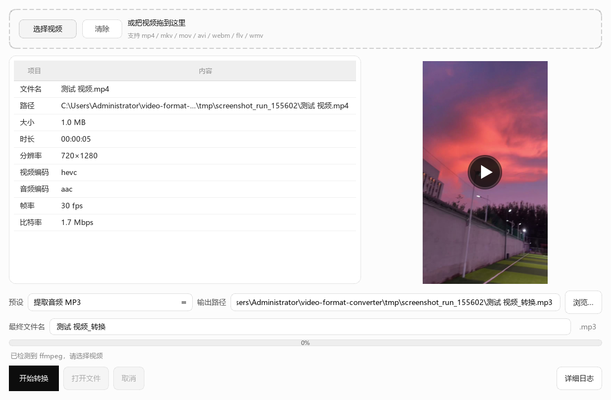

# 视频格式转换器

**Windows 原生桌面客户端（PySide6/Qt）**，调用本机 ffmpeg 命令行，把视频转成常用格式。



## 这个软件做什么

Windows 桌面软件：选一个本地视频 → 查看信息和封面 → 选转换预设 → 指定输出 → 开始转换。  
转换时有真实进度、可取消；失败会使用白话通俗提示，不会只抛技术错误。

## 使用步骤（打开窗口后）

1. **准备环境**：本机已安装 ffmpeg/ffprobe（见下文「安装 ffmpeg」），再启动本软件。
2. **导入视频**：点「选择视频」，或把视频拖到顶部虚线区域；支持 mp4 / mkv / mov / avi / webm / flv / wmv。  
   - 选错了可点「清除」去掉当前视频。  
   - 一次只处理一个文件；拖入多个时只用第一个视频。
3. **确认信息**：左侧看文件名、时长、分辨率、编码等；右侧看封面，可点播放预览。
4. **选预设**：在「预设」下拉里选一种，例如：
   - 通用 MP4
   - 压缩体积
   - 提取音频 MP3
   - 原画转封装
5. **确认输出**：检查「输出路径」；需要时可改「最终文件名」（后缀随预设变化）。也可用「浏览…」另选位置。
6. **开始转换**：点「开始转换」。进度条会走动；可随时点「取消」（会删掉不完整输出）。
7. **查看结果**：完成后可用「打开文件」或「打开所在文件夹」；状态栏会显示体积变化（如有）。

若未找到 ffmpeg，顶部会出现红色提示，「开始转换」不可用——按下面方法装好后重新打开软件即可。

## 环境要求

- Windows 10/11
- Python 3.10+（源码运行时需要）
- 本机已安装 **ffmpeg / ffprobe**（**不会打进本软件包**）

## 安装 ffmpeg

任选其一：

1. [winget](https://winget.run/)：`winget install Gyan.FFmpeg`
2. 从 [https://www.gyan.dev/ffmpeg/builds/](https://www.gyan.dev/ffmpeg/builds/) 下载，把 `bin` 加入 PATH
3. 或设置环境变量 `VFC_FFMPEG` / `VFC_FFPROBE` 指向可执行文件绝对路径

安装后**新开**终端确认：

```powershell
ffmpeg -version
ffprobe -version
```

## 如何启动

### 方式一：源码运行

```powershell
python -m pip install -r requirements.txt
python -m app.main
```

### 方式二：已打包 exe（可选）

本机打包后得到：

`dist/VideoFormatConverter/VideoFormatConverter.exe`

1. 确保本机 PATH 中有 ffmpeg/ffprobe  
2. 双击该 exe 运行  

打包命令（开发者）：

```powershell
python -m pip install pyinstaller
pyinstaller --noconfirm --windowed --name VideoFormatConverter app/main.py
```

`dist/`、`build/`、`*.spec` 已在 `.gitignore` 中，**不要提交进仓库**。

## 已实现功能

### 主路径

- 拖放 / 选择视频；清除当前视频
- 显示媒体信息与封面；窗内预览播放
- 四个预设：通用 MP4、压缩体积、提取音频 MP3、原画转封装
- 可改最终文件名；切预设时后缀立刻更新
- 后台 ffmpeg 转换；真实进度；可取消并删除残片
- 输出已存在时询问是否覆盖
- 中文界面；失败有人话提示

### 体验增强

- 记住上次目录、预设、窗口大小
- 完成后「打开文件」+「打开所在文件夹」
- 完成后显示体积变化
- 可折叠详细日志（完整命令、退出码）
- 拖放多文件 / 非视频用人话提示


## 目录说明

```
app/                 程序代码（ui / core / workers）
docs/                需求、阶段状态、决策、实测报告、截图
tests/               单测与本地素材
requirements.txt     运行依赖（仅 PySide6）
```

## 过程文档

- [完整需求与执行方案](docs/完整需求与执行方案.md)
- [阶段状态](docs/PHASE_STATUS.md)
- [决策记录](docs/DECISIONS.md)
- [会话总结](docs/SESSION_SUMMARY.md)
- [AI 反馈](docs/AI_FEEDBACK.md)
- [实测报告](docs/TEST_REPORT.md)

## 已知限制

- 必须本机已安装 ffmpeg/ffprobe；未找到时界面会提示，不会自动下载
- 一次只转一个文件；不做批量队列
- 原画转封装依赖源编码能否直接装进 MP4，失败请改用「通用 MP4」
- 打包 exe **不包含** ffmpeg；换机器仍需自行安装
